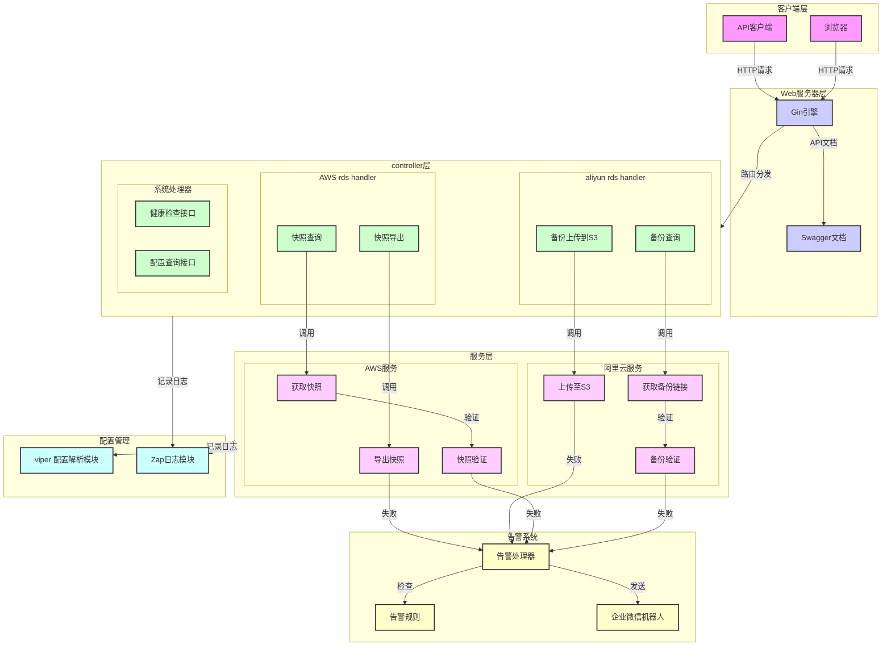
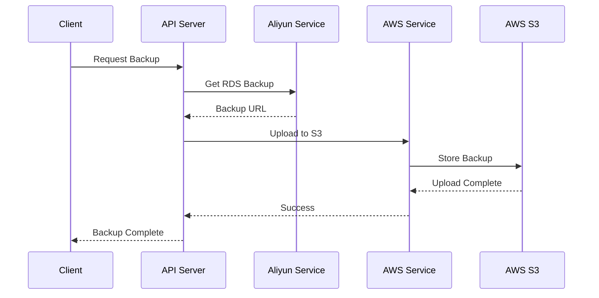

```mermaid

graph TD
    subgraph Client[客户端层]
        Browser[浏览器]
        APIClient[API客户端]
    end

    subgraph WebServer[Web服务器层]
        GinEngine[Gin引擎]
        Swagger[Swagger文档]
    end

    subgraph Handlers[controller层]
        direction LR
        subgraph AliHandlers[aliyun rds handler]
            AliBackupHandler[备份查询]
            AliExportHandler[备份上传到S3]
        end
        subgraph AwsHandlers[AWS rds handler]
            AwsBackupHandler[快照查询]
            AwsExportHandler[快照导出]
        end
        subgraph SystemHandlers[系统处理器]
            HealthHandler[健康检查接口]
            ConfigHandler[配置查询接口]
        end
    end

    subgraph Services[服务层]
        direction LR
        subgraph AliyunService[阿里云服务]
            GetBackupURLs[获取备份链接]
            UploadToS3[上传至S3]
            ValidateBackup[备份验证]
        end
        subgraph AWSService[AWS服务]
            GetSnapshot[获取快照]
            ExportSnapshot[导出快照]
            ValidateSnapshot[快照验证]
        end
    end

    subgraph AlertSystem[告警系统]
        AlertHandler[告警处理器]
        AlertRules[告警规则]
        WeworkBot[企业微信机器人]
    end

    subgraph Config[配置管理]
        ConfigLoader[ viper 配置解析模块 ]
        Logger[ Zap日志模块 ]
    
    end

    Browser -->|HTTP请求| GinEngine
    APIClient -->|HTTP请求| GinEngine
    GinEngine -->|API文档| Swagger
    GinEngine -->|路由分发| Handlers

    AliBackupHandler -->|调用| GetBackupURLs
    AliExportHandler -->|调用| UploadToS3
    AwsBackupHandler -->|调用| GetSnapshot
    AwsExportHandler -->|调用| ExportSnapshot

    GetBackupURLs -->|验证| ValidateBackup
    GetSnapshot -->|验证| ValidateSnapshot
    
    ValidateBackup -->|失败| AlertHandler
    ValidateSnapshot -->|失败| AlertHandler
    UploadToS3 -->|失败| AlertHandler
    ExportSnapshot -->|失败| AlertHandler
    
    AlertHandler -->|检查| AlertRules
    AlertHandler -->|发送| WeworkBot
    
    Services -->|读取配置| ConfigLoader
    Services -->|记录日志| Logger
    Handlers -->|记录日志| Logger

    classDef client fill:#f9f,stroke:#333,stroke-width:2px
    classDef server fill:#ccf,stroke:#333,stroke-width:2px
    classDef handler fill:#cfc,stroke:#333,stroke-width:2px
    classDef service fill:#fcf,stroke:#333,stroke-width:2px
    classDef alert fill:#ffc,stroke:#333,stroke-width:2px
    classDef config fill:#cff,stroke:#333,stroke-width:2px
    
    class Browser,APIClient client
    class GinEngine,Swagger server
    class AliBackupHandler,AliExportHandler,AwsBackupHandler,AwsExportHandler,HealthHandler,ConfigHandler handler
    class GetBackupURLs,UploadToS3,GetSnapshot,ExportSnapshot,ValidateBackup,ValidateSnapshot service
    class AlertHandler,AlertRules,WeworkBot alert
    class ConfigLoader,Logger config
```

```mermaid
sequenceDiagram
    participant C as Client
    participant A as API Server
    participant AL as Aliyun Service
    participant AW as AWS Service
    participant S3 as AWS S3
    
    C->>A: Request Backup
    A->>AL: Get RDS Backup
    AL-->>A: Backup URL
    A->>AW: Upload to S3
    AW->>S3: Store Backup
    S3-->>AW: Upload Complete
    AW-->>A: Success
    A-->>C: Backup Complete
```

